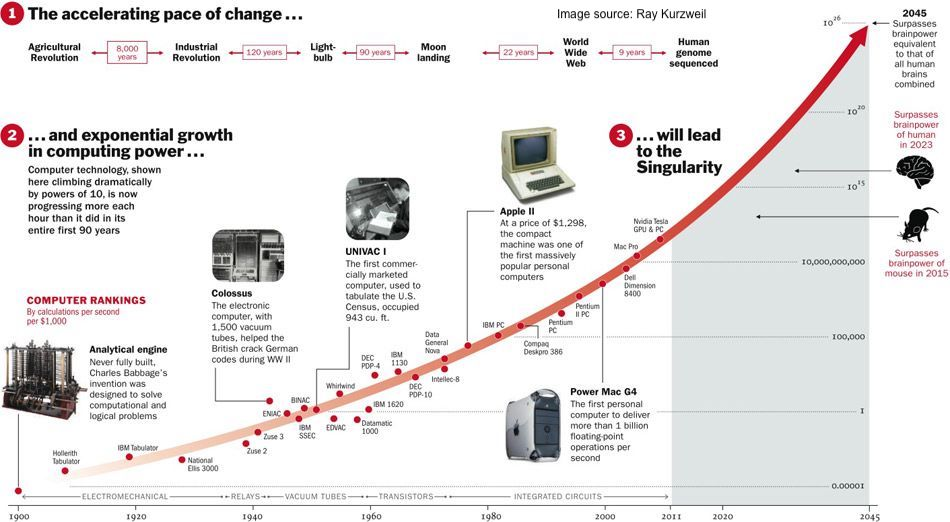

# NorthLightProject

Today, people who have internet connections are often overwhelmed by data overload.

Computer technology has been climbing exponentially, and is now progressing more each hour than it did in its entire first 90 years.

It is estimated that computation power will surpass human brainpower in 2023, which is just two years away from now.

This affects many aspect of our lives. Some of the drawbacks we are experiencing at right now include the prevalence of fake news, data fatigue, distrust in news reports and statistic data, and an overwhelmingly common attitude of indifference. The words we often use to describe people are:

* Aloof
* Impassive
* Insensitive
* Lukewarm
* Unsympathetic
* Apathetic

Imagine in your mind that a person’s brainpower, their ability to absorb outside information, is like a piece of white paper, and each data point they receive from the outside is like a little black dot dropped on this piece of white paper. Starting from ancient times, as we had more and more exposure to data, there were more and more black dots dropped onto this white paper. At some point of time, there will be so many black dots that they completely cover the white paper, and the white paper now turns black. That will be the time when computation power surpasses the brainpower of human beings. 

At this time, we will lose our ability for clear, conscious thinking. Common sense will get shuffled away by what seems like the common practices of society, broadcasted in fake news. Objective news will cease to exist, buried underneath bot generated fake news in just a few minutes after the original news is published. Wise people will be afraid to speak out on public concerns, because the moment they speak out, they will be personally ridiculed and their content altered, pirated and smeared by AI controlled bots.

When this happens, the human race will enter a dark age, an age where we are blinded by the sheer volume of data, isolated by bots, silenced by the noise and impoverished by market manipulation.

When such a situation happens, the human race will lose our way. Civilization will sound like a fairytale. People will lose their judgment on what is right and what is wrong, and they will lose their conscience, their integrity and their soundness of mind.

This is a problem that needs to be solved for the common good, and this is a giant leap that the human race has to take.

The clue to solving this problem is in nature. It has been with us since the creation of the earth.

Every moment in our lives is unique, and nothing stays the same. The data that occurs at each millisecond is different. Look at the night sky, for example. The earth is constantly rotating in its orbit, and the location and brightness of the stars in the sky are constantly changing. In this constantly changing world, human beings learned to navigate the ocean thousands of years ago. How did they do it? They learned to read the constant patterns in the constantly changing night sky. 

Polaris, commonly the North Star or Pole Star, is the brightest star of the constellation Ursa Minor. Because Polaris lies nearly in a direct line with the Earth's rotational axis, "above" the North Pole—the north celestial pole—Polaris stands almost motionless in the sky, and all the stars of the northern sky appear to rotate around it. Therefore, it makes an excellent fixed point from which to draw measurements for celestial navigation and astrometry.

People in ancient times learned to read the north star and use it to guide them when sailing through the ocean.

For the human race, it is the same story. Our common sense and our judgement of what is right and wrong are knowledge accumulated over generations. They apply to all human generations, races and countries. They need to be preserved and applied to society, integrated to the current moment and actively advocated for and adapted to current events.

The problem is that it is difficult to advocate for common sense. Our media is basically a pile of sand. Whatever gets dumped on top of the pile gets people’s attention for a few seconds, and is then buried under the new layer of sand that gets dumped on top. When most of the sand is generated by bots, it is impossible to pick real, authentic information out of a pile of junk.

Common sense usually stays in the history books. You cannot drag George Washington out of a history book and ask him to give an opinion on current political affairs. And if you ask an economist about an economic problem, 9 out of 10 will give you an ambiguous answer, because they want to keep their jobs, and not be accused of anything outrageous.

But if you ask people who are affected by economic problems, and give them 3 options that can help them improve their situation, they will probably give you honest answers, and actively help you to improve those 3 options.

Common sense, the best practice for how to run human societies, needs to be implemented as a decentralized system, not managed by any government or controlled by any society. It needs to be actively maintained by the people who care about it, who live the outcome, who actively advocate it, and who use the best practices to address the current issues in their societies and improve them. 

When political agendas are removed from the recording and registration of best practices, complicated problems become much easier to solve, and complicated issues have much simpler answers. People have more courage to speak out and be their authentic selves. 

I call this project the North Light project. This is a decentralized project to preserve and allow people to reference and use best practices that accumulated from generations of human societies. So that no matter how much data gets generated by computers and AI, people can reference the best practices, and manage their societies in a wise and peaceful manner.

There are some basic requirements for this system.
1. The user interface is very simple and easy to use. 
2. It has categories of topics, each addressing a different type of issue.
3. It leverages blockchain registry, and records authentic content surrounding each topic.
4. People can create immutable and timestamped digital content to be stored in the system.
5. It can verify that the person who contributes the content is an authentic human being, who is willing to prove that they are the creator of the content.
6. It allows users to easily enter keywords, and pull out a few recipes of best practices for solving a real-world issue.
7. It has a survey or poll system, for people to give feedback on implementing or using a best practice in their society, the problems they solve, the outcomes they achieve, and the improvements that need to be made.
8. The system can consolidate feedback and provide granular variations and recipes for users to customize the best practices to address the specific issues in their society.

Technology used including:
W3, Dapp, blockchain, solidity, javascript, html, css and more.

Donations are welcome! Without sufficient funding, it is impossible to build this project.
ETH and BEP20 address: 0xE53c71752A042B18bF72a35480565c9A23F4aa2C

Development and other types of contributions are welcome! This project is built for all the people in this world, and it should be built by all the people in this world.
